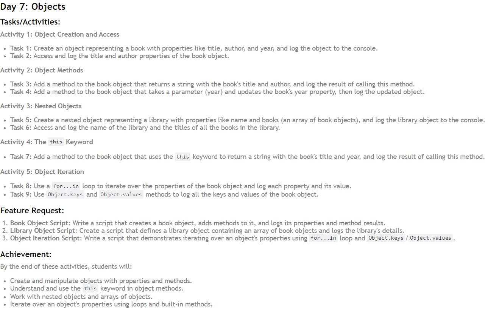

 This README provides the syntax and definitions for each part, offering a clear guide to understanding and implementing object manipulation in JavaScript.

Images made by Hitesh Choudhary [Chai aur CodeYT Channel]


---
# Objects

## Object Creation and Access

**Create an Object**

**Syntax:**
```javascript
let objectName = {
    property1: value1,
    property2: value2,
    ...
};
console.log(objectName);
```
**Definition:** Create an object with specified properties and values, and log the object to the console.

**Access Object Properties**
**Syntax:**
```javascript
console.log(objectName.propertyName);
console.log(objectName["propertyName"]);
```
**Definition:** Access and log the specified properties of the object.

## Object Methods

**Add a Method to the Object**
**Syntax:**
```javascript
objectName.methodName = function() {
    return `string with ${this.property1} and ${this.property2}`;
};
console.log(objectName.methodName());
```
**Definition:** Add a method to the object that returns a string using the object's properties, and log the result.

**Add a Method to Update a Property**
**Syntax:**
```javascript
objectName.methodName = function(parameter) {
    this.propertyName = parameter;
};
objectName.methodName(newValue);
console.log(objectName);
```
**Definition:** Add a method to the object that takes a parameter to update a specific property, then log the updated object.

## Nested Objects

**Create a Nested Object**
**Syntax:**
```javascript
let nestedObjectName = {
    property1: value1,
    nestedProperty: [
        {
            subProperty1: subValue1,
            ...
        },
        ...
    ]
};
console.log(nestedObjectName);
```
**Definition:** Create a nested object with an array of objects as one of its properties, and log the nested object to the console.

**Access Nested Object Properties**
**Syntax:**
```javascript
console.log(nestedObjectName.propertyName);
nestedObjectName.nestedProperty.forEach(subObject => {
    console.log(subObject.subPropertyName);
});
```
**Definition:** Access and log the properties of the nested object and its nested objects.

## The `this` Keyword

**Add a Method Using `this`**
**Syntax:**
```javascript
objectName.methodName = function() {
    return `Title: ${this.property1}, Year: ${this.property2}`;
};
console.log(objectName.methodName());
```
**Definition:** Add a method to the object that uses the `this` keyword to access the object's properties, and log the result.

## Object Iteration

**Iterate Over Object Properties**
**Syntax:**
```javascript
for (let key in objectName) {
    console.log(`${key}: ${objectName[key]}`);
}
```
**Definition:** Use a `for...in` loop to iterate over the properties of the object and log each property and its value.

**Log Object Keys and Values**
**Syntax:**
```javascript
console.log(Object.keys(objectName));
console.log(Object.values(objectName));
```
**Definition:** Use `Object.keys` and `Object.values` methods to log all the keys and values of the object.
