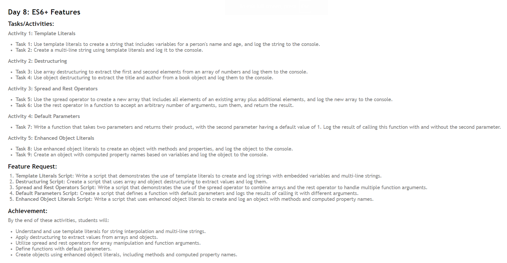

# ES6+ Features

## Template Literals
Template literals allow for easy string creation with embedded variables and expressions, and support multi-line strings.
```javascript
`String text ${expression}`
```

## Destructuring
Destructuring enables extracting values from arrays or objects into distinct variables.
```javascript
// Array Destructuring
let [variable1, variable2] = array;

// Object Destructuring
let {property1, property2} = object;
```

## Spread and Rest Operators
The spread operator expands an iterable (like an array) into individual elements, while the rest operator collects multiple arguments into a single array.
```javascript
// Spread Operator
let newArray = [...existingArray, element];
functionName(...args);

// Rest Operator
function functionName(...args) { /* function body */ }
```

## Default Parameters
Default parameters allow function parameters to have default values if no value or `undefined` is passed.
```javascript
function functionName(parameter1, parameter2 = defaultValue) { /* function body */ }
```

## Enhanced Object Literals
Enhanced object literals simplify object creation with property value shorthand, method definitions, and computed property names.
```javascript
let object = {
    propertyName,
    methodName() { /* method body */ },
    [computedPropertyName]: value
}
```


Refer: Image made by Hitesh Choudhary
